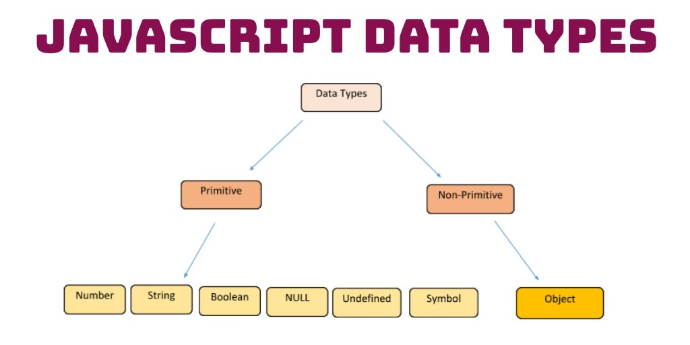
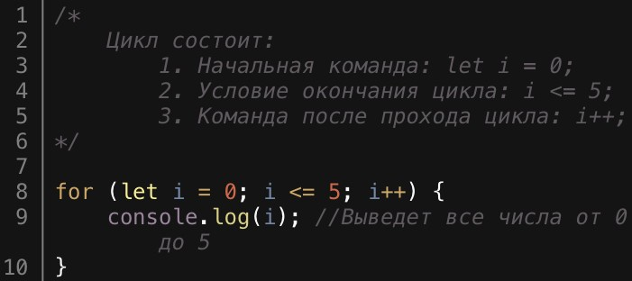
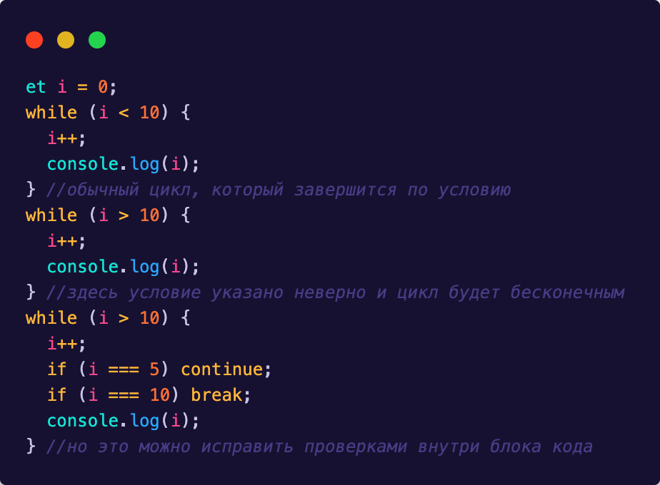
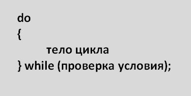
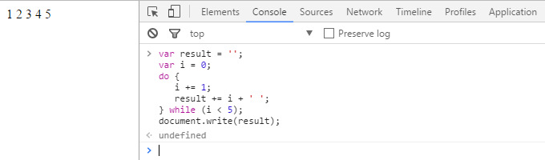
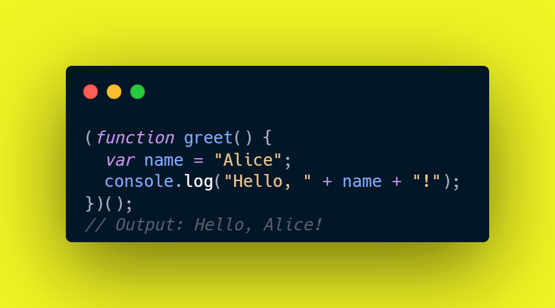

# Что такое JavaScript?
JavaScript – это язык программирования, который используют разработчики для создания интерактивных веб-страниц. Функции JavaScript могут улучшить удобство взаимодействия пользователя с веб-сайтом: от обновления ленты новостей в социальных сетях и до отображения анимации и интерактивных карт. JavaScript является языком программирования при разработки скриптов для выполнения на стороне клиента, что делает его одной из базовых технологий во всемирной сети Интернет. Например, карусель изображения, выпадающее по клику меню и динамично меняющиеся цвета элементов на веб-странице, которые вы видите во время просмотра страниц в Интернете, выполнены при помощи JavaScript.  
    
       
          
 # Кто является основателем JavaScript?         
  Самая первая реализация JavaScript была создана Бренданом Эйхом (англ. Brendan Eich) в компании Netscape, и с тех пор обновляется, чтобы соответствовать ECMA-262 Edition 5 и более поздним версиям. Этот движок называется SpiderMonkey и реализован на языке C/C++. Движок Rhino создан Норрисом Бойдом (англ. Norris Boyd) и реализован на языке Java. Как и SpiderMonkey, Rhino соответствует ECMA-262 Edition 5.   
    
      
  

  # Типы данных языка JavaScript
  ## 1. Oбъективные (НЕ примитивные)    
  ## 2. Примитивные
  

  # Объективный (НЕ примитивный)  тип данных

 Объект (object) - Простая структура, используемая не только для хранения данных, но и для создания других структур, где любая структура создаётся с использованием ключевого слова new: new Object, new Array, new Map, new Set, new WeakMap, new WeakSet, new Date и множество других структур;  
   
   В этой тип данных входят массивы(array), функции (functions) и другие значения.
  
  # Примитивный тип данных

  Все типы данных в JavaScript, кроме объектов, являются иммутабельными (значения не могут быть модифицированы, а только перезаписаны новым полным значением). Например, в отличии от C, где строку можно посимвольно корректировать, в JavaScript строки пересоздаются только полностью. Значения таких типов называются «примитивными значениями».

  ### Пример
  

# Операторы JavaScript
В JavaScript есть следующие типы операторов.   

1.Операторы присваивания  

2.Операторы сравнения  

3.Арифметические операторы  

4.Битовые (поразрядные) операторы  

5.Логические операторы  

6.Строковые операторы  

7.Условный (тернарный) оператор  

8.Оператор запятая  

9.Унарные операторы  

10.Операторы отношения  

11.Приоритет операторов  
  

# Циклы JavaScript
### Циклы имеют 3 типа:
#### 1.   Цикл(for)
#### 2.   Цикл(while)
#### 3.   Цикл(do while)

# Цикл «for»
Оператор for создаёт цикл, состоящий из трех необязательных выражений, заключенных в круглые скобки и разделенных точкой с запятой, за которыми следует инструкция (часто блок инструкций), которая должна выполняться в цикле.    

# Цикл (while)
Оператор while создаёт цикл, выполняющий заданную инструкцию, пока истинно проверяемое условие. Логическое значение условия вычисляется перед исполнением тела цикла.  

#  Цикл (do while)  

Выражение do...while создаёт цикл, который выполняет указанное выражение до тех пор, пока условие не станет ложным. Условие проверяется после выполнения выражения, то есть выражение выполнится как минимум один раз.

  

  

# Функции в JavaScript  
Любая функция это объект, и следовательно ею можно манипулировать как объектом, в частности:

передавать как аргумент и возвращать в качестве результата при вызове других функций функций высшего порядка;  

создавать анонимно и присваивать в качестве значений переменных или свойств объектов.  

## Функции имеют 3 вида
#### 1.Функции вида (Declaration)
#### 2.Функции вида (expression)
#### 3.Функции вида (IIFE)

# Функции вида (Declaration)  

Объявление функции (function definition, или function declaration, или function statement) состоит из ключевого слова function и следующих частей:

Имя функции.
Список параметров (принимаемых функцией) заключённых в круглые скобки () и разделённых запятыми.
Инструкции, которые будут выполнены после вызова функции, заключают в фигурные скобки { }.

#   Функции вида (expression)

Объявление функции (function definition, или function declaration, или function statement) состоит из ключевого слова function и следующих частей:

Имя функции.
Список параметров (принимаемых функцией) заключённых в круглые скобки () и разделённых запятыми.
Инструкции, которые будут выполнены после вызова функции, заключают в фигурные скобки { }.

  

#   Функции вида (IIFE)

IIFE ( Immediately Invoked Function Expression) — это функция JavaScript , которая запускается сразу после определения.
 
